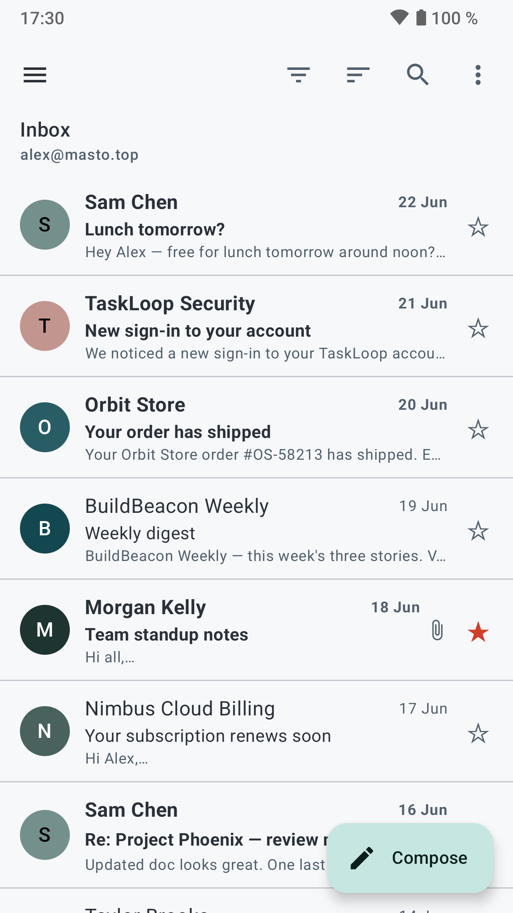
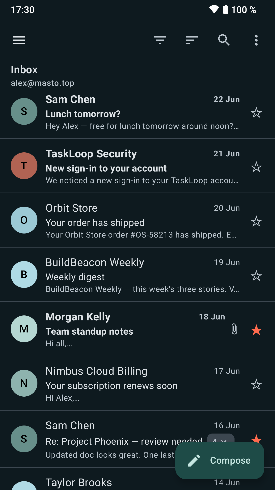
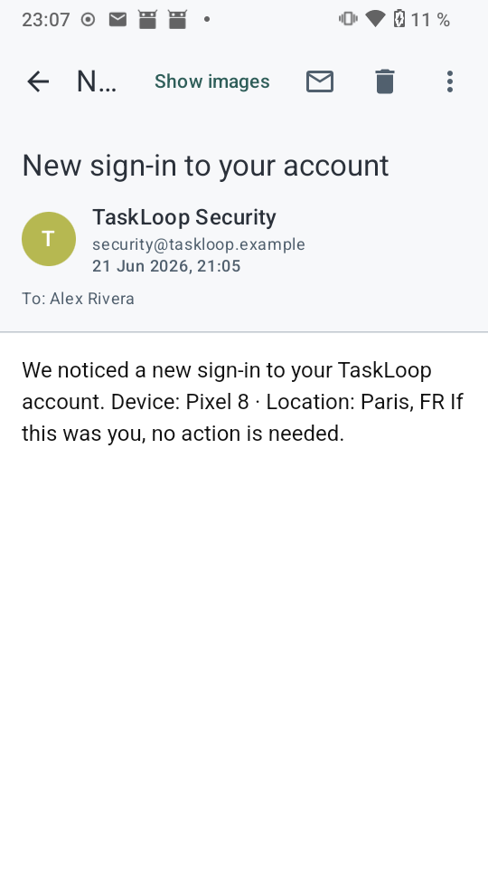
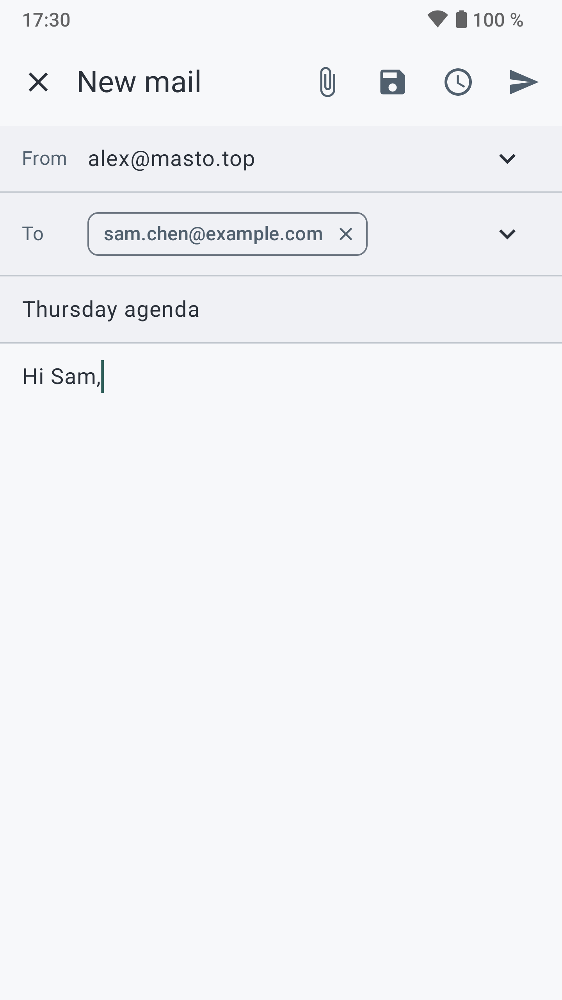
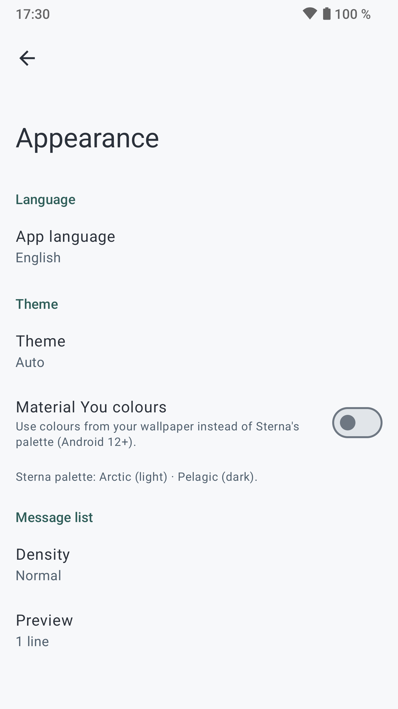

  

<h1 align="center">Sterna Mail</h1>

  <b>All your mail. None of the baggage.</b> 
  A fast, private <b>JMAP email client for Android</b>, fluent in classic <b>IMAP/SMTP</b> too. 
  No ads. No tracking. No Google. ✨

  
  
  
  
  

Sterna Mail is open-source and built for **JMAP**, the new and faster internet
standard for email, with full support for classic **IMAP/SMTP** too. Just your
mail, on the server *you* choose.

> _Named after **Sterna**, the genus of terns 🐦 — the Arctic tern flies the
> longest migration of any animal, carrying itself clear across the world and back
> every single year. We liked the idea of mail that travels light and always finds
> its way home._

> **Status: 1.1, and shipping.** Sterna is a complete, daily-drivable email
> client: read, organise, search, write, schedule, and send mail (with
> attachments) over JMAP or IMAP/SMTP, across multiple accounts, fully
> offline-capable, with OpenPGP encryption, push notifications, and remote
> content blocked by default. Hit a rough edge? Please tell us about it!

## 📸 A look

| Inbox (light) | Inbox (dark) | Reading | Compose | Appearance |
|:---:|:---:|:---:|:---:|:---:|
|  |  |  |  |  |

*Light "Arctic" and dark "Pelagic" themes, a calm sea-teal accent with a warm
coral touch — the tern's beak. 🪸*

## 📲 Download & install

**The easy way — [get it on F-Droid](https://f-droid.org/packages/app.sterna/)** 🎉
Install it from the F-Droid app (or its website) and updates arrive automatically.

Prefer a direct download? Grab the **latest APK** yourself:

1. **[⬇️ Download the latest APK](https://codeberg.org/emon/sterna-mail/releases/latest)** (under *Assets*).
2. Open the downloaded `.apk` on your phone. Android will ask whether to **allow
   installing apps from this source** — accept it for your browser or file manager.
3. Tap **Install**, then open Sterna and add your account.

> ℹ️ Sterna's builds are **reproducible**, and F-Droid verifies them: the APK it
> distributes is byte-for-byte the one released here, signed with Sterna's own
> key — so the two install sources update cleanly over each other. No Google
> account or app store needed, ever.

Prefer to build it yourself? See [CONTRIBUTING.md](CONTRIBUTING.md).

## 🤔 Why JMAP?

Most email apps talk to your server using an old protocol called IMAP. **JMAP** is
its modern successor: it syncs faster, uses less battery and data, and was designed
for today's phones. Servers like [Stalwart](https://stalw.art/) speak JMAP, and
Sterna is built to make the most of it. ⚡

Sterna also speaks classic **IMAP and SMTP**, so it works with any standard mail
provider — pick the protocol when you add an account, or just type your email and
let autodiscovery find the server for you.

## 💚 What Sterna stands for

- **🔒 Privacy first.** No tracking, no ads, no analytics, no Google services.
  Remote images and tracking pixels are blocked by default; tapped links can be
  stripped of tracking parameters and confirmed before opening.
- **🆓 Free and open.** Licensed under the GPLv3 — anyone can read, audit, and
  improve the code.
- **🎨 Modern and calm.** A clean, fast Material 3 interface with its own brand
  identity that follows your phone's theme and language.

## ✨ Features

**📥 Reading & organising**
- Unified inbox across multiple accounts (JMAP and/or IMAP/SMTP), fully offline
  (local cache); large folders page in as you scroll, fetching older mail from
  the server
- Conversation view — threads collapse into one row with a message count
- Nested folders shown as a collapsible tree; create / rename / delete, plus
  subfolders
- Configurable swipe actions, flag/star, archive & delete with undo, multi-select
  bulk actions, snooze, report spam, empty trash (with undo), sort and unread-only
  filter
- Search-as-you-type (server-side + instant local results) with advanced filters
  (from, subject, has-attachment, date)
- Calendar invites preview as an event card; one tap adds them to your calendar
  app (no calendar permission needed)

**✍️ Writing & sending**
- Compose with recipient chips + autocomplete and email validation, multiple
  identities each with its own signature, attachments, and drafts
- Undo send, schedule send (with a screen to view/cancel pending sends), and
  "forgot attachment?" / large-recipient-list reminders
- Opens `mailto:` links from any app or browser, prefilled (addresses, subject,
  body, cc/bcc)

**🔑 Accounts & setup**
- Add an account with just email + password (`/.well-known/jmap` autodiscovery),
  password-free **OAuth 2.0** sign-in (device flow), or manual IMAP/SMTP with
  provider presets; a "test connection" button before saving
- Per-account colour, sync window, and notification toggle; encrypted credential
  storage (AndroidKeyStore); app lock (biometric / PIN)

**🔒 Encryption**
- **OpenPGP** (via [OpenKeychain](https://f-droid.org/packages/org.sufficientlysecure.keychain/)):
  read and send signed and/or encrypted mail (PGP/MIME) on both JMAP and
  IMAP/SMTP. Decrypted content is never written to disk. See the
  [encryption guide](ENCRYPTION.md) to get started.

**🔔 Notifications & server power**
- Push for new mail with **no Google / FCM** (JMAP EventSource or IMAP IDLE),
  grouped per account, with quiet hours
- Server-side **vacation responder** and **Sieve filter rules**, mailbox quota
  display

**🎨 Polish**
- Sterna's own Arctic (light) / Pelagic (dark) palette, optional Material You,
  adjustable message text size, settings export/import, a screen-reader-friendly
  UI, and coastal empty-state illustrations

The full, tracked feature set lives in [FEATURES.md](FEATURES.md).

**🛠️ Planned:** home-screen widgets, S/MIME, and more.

## 🌍 Languages

Sterna's interface is fully translated into nine languages:

🇬🇧 English · 🇫🇷 French · 🇩🇪 German · 🇪🇸 Spanish · 🇮🇹 Italian · 🇵🇹 Portuguese ·
🇳🇱 Dutch · 🇷🇺 Russian · 🇵🇱 Polish

It also respects your system language out of the box, and you can override it
per-app in Settings → Appearance.

## 👩‍💻 For developers

Architecture and build instructions live in [ARCHITECTURE.md](ARCHITECTURE.md)
and [CONTRIBUTING.md](CONTRIBUTING.md). The planned and shipped feature set is
tracked in [FEATURES.md](FEATURES.md). Contributions, bug reports and ideas are
very welcome. 🙌

Sterna Mail is built by its author with the help of AI coding assistants, a tool
in the workflow like an IDE or a compiler. All code is reviewed, tested and
maintained by me, and I am responsible for it. The source is GPLv3 and open to
inspection, issues and contributions.

## ☕ Support

Sterna is free and open, and always will be. If it's useful to you and you'd like
to help fuel its development, you can **[buy me a coffee on Ko-fi](https://ko-fi.com/emoncode)**.
Entirely optional — thank you for even considering it. 💚

## 🙏 Acknowledgements

Sterna's interface is freely inspired by **[K-9 Mail](https://github.com/thunderbird/thunderbird-android)** (now Thunderbird for Android), the venerable open-source Android mail client. Many of its interaction patterns — the way you swipe, triage, and read your mail — are the fruit of years of work by the K-9 community, and Sterna is better for standing on their shoulders. Heartfelt thanks to the K-9 / Thunderbird for Android developers for building, and freely sharing, such a fine app. 💚

## 📄 License

[GNU General Public License v3.0](LICENSE).
